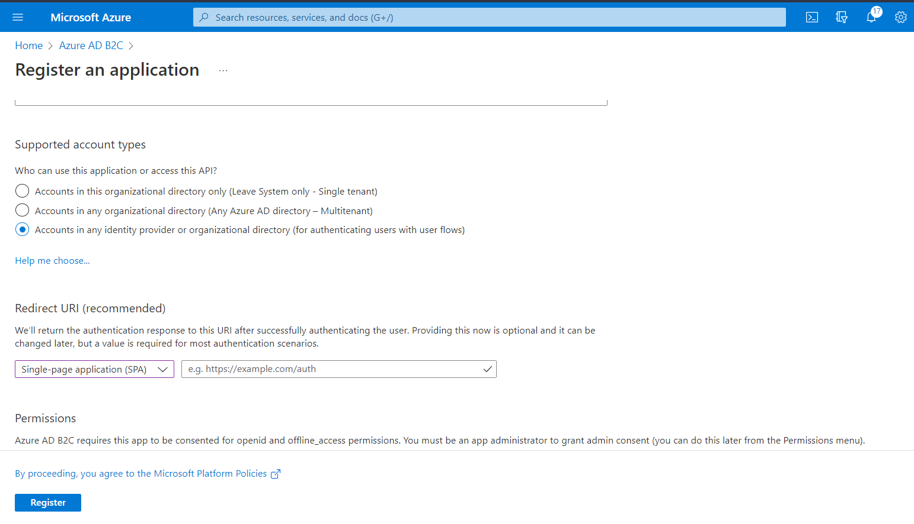
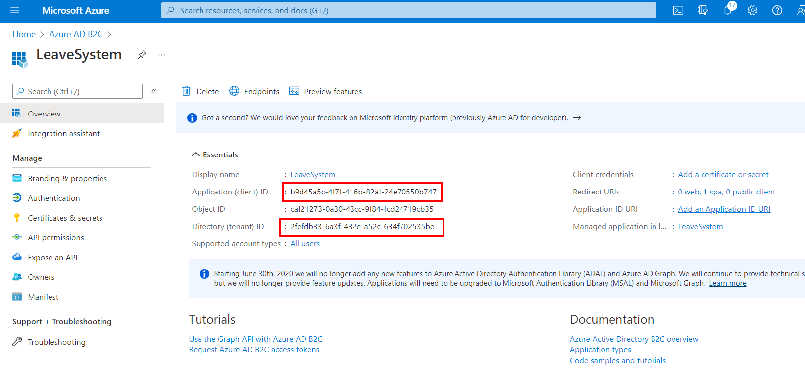
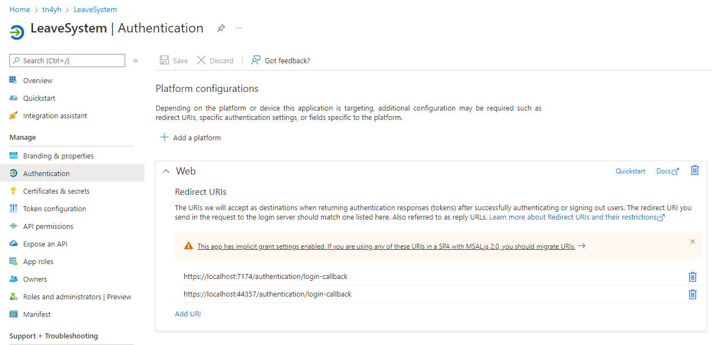

# Leave system

System to manage leaves. 

## Start using the application B2C

1. Clone the project
2. In your Azure create `Azure Active Directory B2C` resource
3. Create an application. In the `Supported account types` choose `Accounts in any identity provider or organizational directory (for authenticating users with user flows)`
4. In the `Redirect URI (recommended)` choose `SPA` : `https://localhost:7174/authentication/login-callback`



5. Update the `ClientId` and `Authority` in the [appsettings.json](./src/LeaveSystem.Web/wwwroot/appsettings.json)



## Start using the application B2B

1. Clone the project
2. Open a terminal and move to the directory with the project `cd LeaveSystem\LeaveSystem.Web`
3. Use the [Azure CLI](https://docs.microsoft.com/en-us/cli/azure/authenticate-azure-cli) to log in to Azure `az login --allow-no-subscriptions`

4. Install [msidentity-app-sync tool](https://github.com/AzureAD/microsoft-identity-web/blob/master/tools/app-provisioning-tool/vs2019-16.9-how-to-use.md) using command 
   
   ```
   dotnet tool install -g msidentity-app-sync
   ```

5. Register the application in Azure
   
   ```
   msidentity-app-sync --tenant-id [tenat-id] --username [username]
   ```
   
   E.g.
   
   ```
   msidentity-app-sync --tenant-id 35ac175a-bb23-4b0a-8b7a-e1d55e5630f9 --username kbroniek@tn4yh.onmicrosoft.com
   ```

6. Cleanup `Program.cs` file and remove redundant line:
   
   ```csharp
   options.ProviderOptions.DefaultAccessTokenScopes.Add("User.Read");
   ```

7. Go to Azure and find the registered application named `LeaveSystem.Web`. Open the Authentication tab and click `This app has implicit grant settings enabled. If you are using any of these URIs in a SPA with MSAL.js 2.0, you should migrate URIs.`.
   
   

8. Migrate all URLs

### Unregister application

Run command

```
msidentity-app-sync --unregister true
```

## Update the Database schema

Working with the database migrations. https://docs.microsoft.com/pl-pl/ef/core/get-started/overview/first-app?tabs=netcore-cli

Run:

```
cd LeaveSystem\LeaveSystem
dotnet ef --startup-project ..\..\LeaveSystem.Api\LeaveSystem.Api\ migrations add InitialCreate
dotnet ef --startup-project ..\..\LeaveSystem.Api\LeaveSystem.Api\ database update
```

## Mapster tool

To generate new mapping I use Mapster. 

**Important: Mapster generate code from dll.**

To regenerate mappers run:

```
dotnet msbuild -t:Mapster
```

To clear all generated files run:

```
dotnet msbuild -t:CleanGenerated
```

More info https://github.com/MapsterMapper/Mapster/wiki/Mapster.Tool.

## Generate security token to the azure B2C

1. Install Azure CLI.
2. Login to the tenant, e.g.

```
az login -t leavesystem.onmicrosoft.com --allow-no-subscriptions
```

3. Get access token and replace guid your scope in your server app (https://www.schaeflein.net/use-a-cli-to-get-an-access-token-for-your-aad-protected-web-api/)

```
az account get-access-token --resource api://4f24b978-403f-47fe-9cae-52deea03661d
```