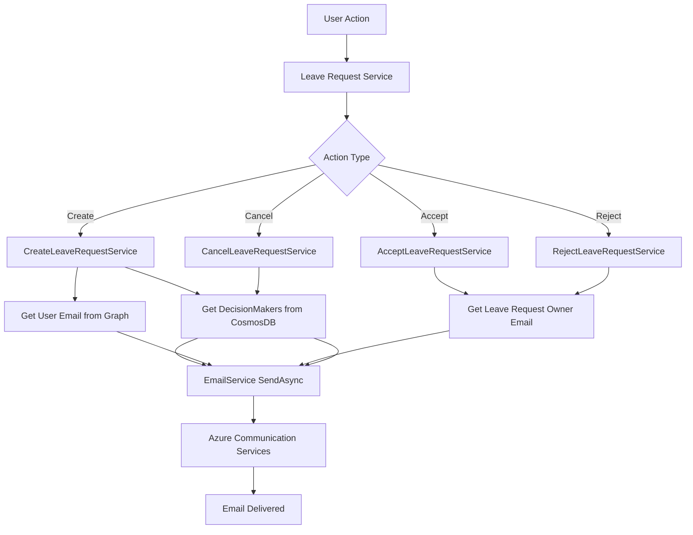

# Email Notifications with Azure Communication Services

## Overview

The Leave System integrates Azure Communication Services (ACS) to send email notifications for leave request lifecycle events. Emails are sent asynchronously when leave requests are created, accepted, rejected, or canceled.

## Architecture

The email notification system follows a fire-and-forget pattern, ensuring that email sending failures don't impact the main leave request operations.



## Components

### Infrastructure

- **Azure Communication Services**: Managed service for sending emails
- **Terraform Configuration**: Infrastructure as Code definitions in `leave-system-iac/config/`

### Backend Services

#### Email Service (`IEmailService`)

Located in `LeaveSystem.Domain/LeaveSystem.Domain/LeaveRequests/Creating/IEmailService.cs`

Interface for sending emails:

- `SendEmailAsync(string to, string subject, string htmlContent, CancellationToken cancellationToken)`
- `SendBulkEmailAsync(IEnumerable<string> recipients, string subject, string htmlContent, CancellationToken cancellationToken)`

Implementation: `LeaveSystem.Functions/LeaveSystem.Functions/Email/EmailService.cs`

#### Email Templates

Located in `LeaveSystem.Domain/LeaveSystem.Domain/LeaveRequests/EmailTemplates.cs`

Provides HTML email templates for:

- Leave request created notifications
- Leave request accepted notifications
- Leave request rejected notifications
- Leave request canceled notifications

#### DecisionMaker Repository

Located in `LeaveSystem.Domain/LeaveSystem.Domain/LeaveRequests/Creating/IDecisionMakerRepository.cs`

Interface for querying DecisionMaker users:

- `GetDecisionMakerUserIds(CancellationToken cancellationToken)`

Implementation: `LeaveSystem.Functions/LeaveSystem.Functions/LeaveRequests/Repositories/DecisionMakerRepository.cs`

Queries CosmosDB Roles container using:

```sql
SELECT c.id FROM c JOIN r IN c.roles WHERE r = "DecisionMaker"
```

#### User Email Support

The `GetUserRepository` has been extended to include email addresses from Microsoft Graph API:

- Updated to fetch `mail` and `userPrincipalName` fields
- Email addresses are included in the `IGetUserRepository.User` record

## Email Scenarios

### 1. Leave Request Created

**Trigger**: When a leave request is successfully created

**Recipients**:

- All users with `DecisionMaker` role
- If created on behalf of another user (`assignedTo != createdBy`), also sends to the assigned user

**Email Content**:

- Leave Request ID
- Employee name
- Date range (from/to)
- Duration
- Working hours
- Leave type (if available)
- Remarks (if any)
- Status
- Created date

**Implementation**: `CreateLeaveRequestService.SendLeaveRequestCreatedEmailsAsync()`

### 2. Leave Request Accepted

**Trigger**: When a DecisionMaker accepts a leave request

**Recipients**:

- The user who owns the leave request (`assignedTo`)

**Email Content**:

- Decision status (Accepted)
- Decision maker name
- Leave Request ID
- Date range
- Duration
- Working hours
- Leave type (if available)
- Remarks (if any)
- Status
- Decision date

**Implementation**: `AcceptLeaveRequestService.SendLeaveRequestAcceptedEmailAsync()`

### 3. Leave Request Rejected

**Trigger**: When a DecisionMaker rejects a leave request

**Recipients**:

- The user who owns the leave request (`assignedTo`)

**Email Content**:

- Decision status (Rejected)
- Decision maker name
- Leave Request ID
- Date range
- Duration
- Working hours
- Leave type (if available)
- Remarks (if any)
- Status
- Decision date

**Implementation**: `RejectLeaveRequestService.SendLeaveRequestRejectedEmailAsync()`

### 4. Leave Request Canceled

**Trigger**: When an employee cancels their own leave request

**Recipients**:

- All users with `DecisionMaker` role

**Email Content**:

- Leave Request ID
- Employee name
- Date range
- Duration
- Working hours
- Leave type (if available)
- Remarks (if any)
- Status
- Canceled date

**Implementation**: `CancelLeaveRequestService.SendLeaveRequestCanceledEmailsAsync()`

## Configuration

### Infrastructure (Terraform)

The Azure Communication Services resource is defined in `leave-system-iac/config/main.tf`:

```hcl
resource "azurerm_communication_service" "acs" {
  name                = var.communication_services_name
  resource_group_name = var.resource_group_name
  data_location       = "Europe"
}
```

The connection string is automatically added to Static Web App app settings:

- `CommunicationServicesConnectionString`

### Application Settings

#### Azure Functions (Static Web App)

The connection string is configured via Terraform in the Static Web App app settings:

- `CommunicationServicesConnectionString`: Primary connection string from ACS resource

#### Local Development

Add to `LeaveSystem.Functions/LeaveSystem.Functions/template.local.settings.json`:

```json
{
  "Values": {
    "CommunicationServicesConnectionString": "{acs-connection-string}"
  }
}
```

## Implementation Details

### Asynchronous Email Sending

All email sending operations are awaited directly:

```csharp
try
{
    await SendEmailAsync(...);
}
catch
{
    // Silently ignore errors in email sending
}
```

This ensures that:

- Email sending completes before the operation returns
- Failures are logged but don't affect leave request processing
- The system remains responsive even if email service is unavailable

### Error Handling

- Email service errors are caught and logged
- Missing email addresses are skipped (logged as warnings)
- Repository failures are handled gracefully
- All operations include proper cancellation token support

### Email Template Styling

Email templates use inline CSS for maximum email client compatibility:

- Responsive design with max-width container
- Color-coded headers (blue for created, green for accepted, red for rejected, orange for canceled)
- Clear information hierarchy with labels and values
- Professional footer with system branding

## Dependencies

### NuGet Packages

- `Azure.Communication.Email`: Azure SDK for sending emails via ACS

### Azure Services

- Azure Communication Services: Email sending service
- Microsoft Graph API: User email address retrieval
- CosmosDB: DecisionMaker role queries

## Troubleshooting

### Email Not Sending

1. **Check ACS Connection String**

   - Verify `CommunicationServicesConnectionString` is set in app settings
   - Ensure the connection string is valid and not expired

2. **Check User Email Addresses**

   - Verify users have email addresses in Microsoft Graph
   - Check that `mail` or `userPrincipalName` fields are populated

3. **Check DecisionMaker Roles**

   - Verify users have the `DecisionMaker` role in CosmosDB Roles container
   - Check the role assignment in the Roles container

4. **Check Logs**
   - Review Application Insights logs for email service errors
   - Look for exceptions in the email sending code paths

### Azure Communication Services Resource Provider

If you encounter an error during Terraform deployment:

```
Error: MissingSubscriptionRegistration: The subscription is not registered to use namespace 'Microsoft.Communication'
```

Register the resource provider:

```bash
az provider register --namespace Microsoft.Communication --subscription "{subscription_id}"
```

Check registration status:

```bash
az provider show --namespace Microsoft.Communication --subscription "{subscription_id}" --query "registrationState"
```

See the [Infrastructure README](../../leave-system-iac/README.md#troubleshooting) for more details.

### Email Domain Configuration

Azure Communication Services uses a default domain (`DoNotReply@leave-system.azurecomm.net`). To use a custom domain:

1. Add a domain in Azure Communication Services portal
2. Verify domain ownership
3. Update the `EmailService` constructor to use your custom domain

## Testing

### Local Testing

1. Set up a local ACS connection string in `local.settings.json`
2. Ensure test users have email addresses in Microsoft Graph
3. Create test leave requests and verify emails are sent
4. Check Application Insights or console logs for email sending status

### Production Testing

1. Verify ACS resource is deployed and connection string is configured
2. Test each email scenario:
   - Create a leave request (should notify DecisionMakers)
   - Accept a leave request (should notify employee)
   - Reject a leave request (should notify employee)
   - Cancel a leave request (should notify DecisionMakers)
3. Verify emails are received and formatted correctly

## Future Enhancements

Potential improvements:

- Custom email domain configuration
- Email template customization
- Email preferences per user
- Retry logic for failed email sends
- Email delivery status tracking
- Multi-language email templates
