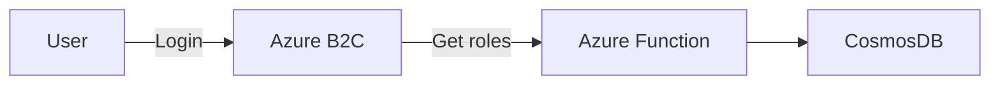

# Azure B2C custom policy

## Overview

The custom policy gives a opportunity to get Roles from CosmosDB and put it to token claims.

## Import Azure B2C custom policy

1.  Do a tutorial https://learn.microsoft.com/en-us/azure/active-directory-b2c/tutorial-create-user-flows?pivots=b2c-custom-policy
2.  In this order, upload the policy files:
    1.  TrustFrameworkBase.xml
    2.  TrustFrameworkLocalization.xml
    3.  TrustFrameworkExtensions.xml
    4.  TrustFrameworkExtensions_SSPR.xml
    5.  TrustFrameworkExtensions_Roles.xml
    6.  SigninCustom_SSPR
