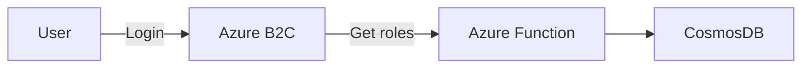
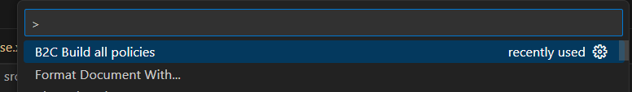

# Azure B2C custom policy

## Overview

The custom policy gives a opportunity to get Roles from CosmosDB and put it to token claims.

## Build policies

The configuration file is `appsettings.json`.

1. Install VSCode extension https://marketplace.visualstudio.com/items?itemName=AzureADB2CTools.aadb2c
2. Build extension 
3. Output is in the `out` folder.

## Import Azure B2C custom policy

1.  Do a tutorial https://learn.microsoft.com/en-us/azure/active-directory-b2c/tutorial-create-user-flows?pivots=b2c-custom-policy
2.  In this order, upload the policy files:
    1.  TrustFrameworkBase.xml
    2.  TrustFrameworkLocalization.xml
    3.  TrustFrameworkExtensions.xml
    4.  TrustFrameworkExtensions_SSPR.xml
    5.  TrustFrameworkExtensions_Roles.xml
    6.  SigninCustom_SSPR
3. Add setting for endpoint provides roles:
   1. B2C_1A_RestApiUsername - technical username
   2. B2C_1A_RestApiPassword - technical password

## Helpful links

- https://github.com/Azure-Samples/active-directory-b2c-custom-policy-starterpack
- https://www.youtube.com/watch?v=eFcoRa79FqA
- https://github.com/azure-ad-b2c/samples/tree/master/policies