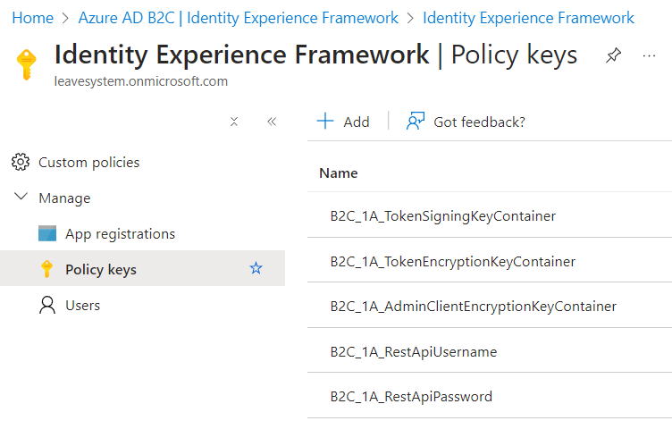

# E2E tests

## Overview

E2E tests has been written using httpyac. You can run a test individually or all.

You need to create the `secrets.http` file and put the content:

```http
@b2cUsername=<b2c-username>
@b2cPassword=<b2c-password>

@userRoleB2C=<user-id>
@technicalB2CUsername=<tech-username>
@technicalB2CPassword=<tech-password>
```

- `<b2c-username>` - B2C username e.g. test@test.com
- `<b2c-password>` - B2C user password.
- `<user-id>` - B2C user id. You can grab it when you invoke the `check-claims.http` endpoint and the  `http://schemas.xmlsoap.org/ws/2005/05/identity/claims/nameidentifier` property.
- `<tech-username>` - this is randomly generated string put in to the b2c settings. It should be in the `src\LeaveSystem.Functions\LeaveSystem.Functions.Roles\local.settings.json` settings `RestApiUsername` as well.
- `<tech-password>` - this is randomly generated string put in to the b2c settings. It should be in the `src\LeaveSystem.Functions\LeaveSystem.Functions.Roles\local.settings.json` settings `RestApiPassword` as well.
