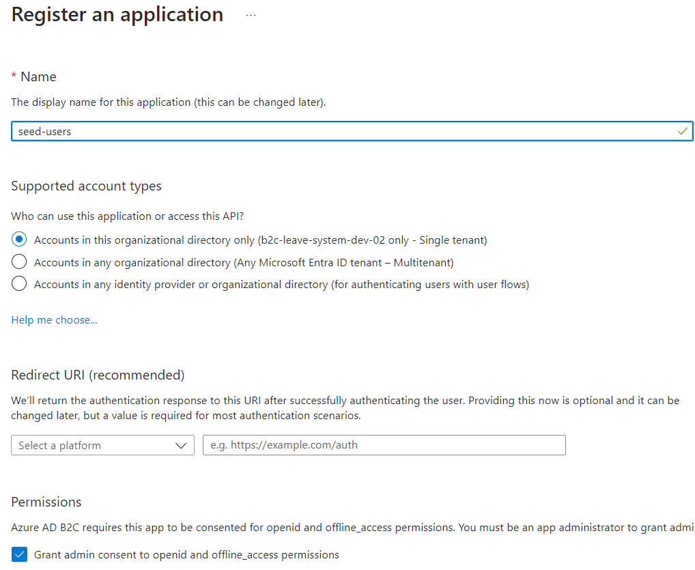
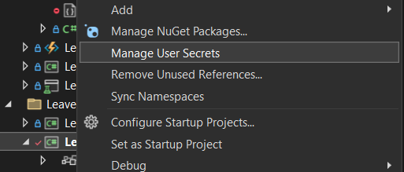

# Legacy seeder

## Steps to seed old data

The seeder transfer data from PostgreSQL to CosmosDB and users to Azure B2C.

1. Create an application in the Azure B2C.

2. Add permissions `User.ReadWrite.All`.
3. Create a new client secret and copy value.
4. Put value in the secret app.

5. Structure:
```json
{
  "ConnectionStrings": {
    "CosmosDBConnection": "AccountEndpoint={url};AccountKey={secret}",
    "PostgreSQLConnectionString": "PORT = 5432; HOST = localhost; TIMEOUT = 15; POOLING = True; MINPOOLSIZE = 1; MAXPOOLSIZE = 100; COMMANDTIMEOUT = 20; DATABASE = 'omb'; PASSWORD = '{secret}'; USER ID = 'postgres'"
  },
  "WriteAzureUsers": {
    "TenantId": "{guid}",
    "ClientId": "{guid}",
    "Secret": "{secret}",
    "Scopes": [ "https://graph.microsoft.com/.default" ]
  },
  "DefaultUsersPassword": "{secret}",
  "B2CIssuer": "leavesystemdev02.onmicrosoft.com"
}
```

